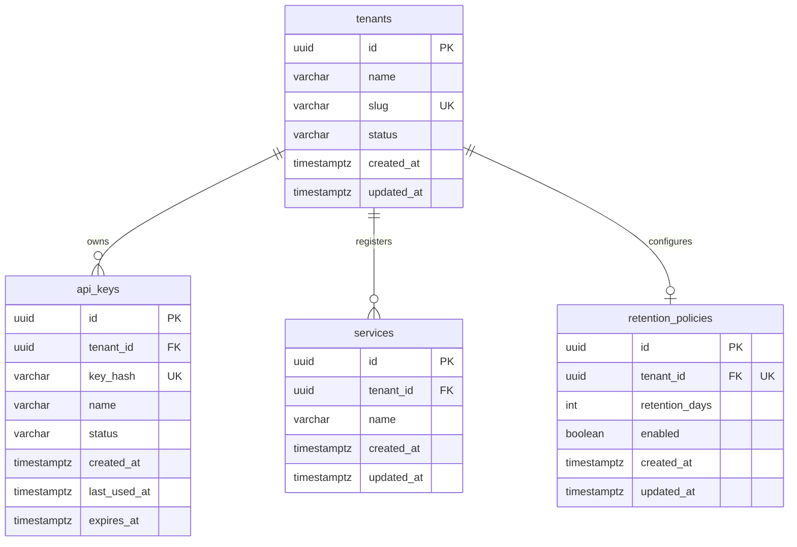

# Data Model & Schema Design

> **Version:** 1.0  
> **Date:** 2026-08-06  
> **Status:** Draft  
> **Related:** `01-scope.md`, `03-api-spec.md`

---

## 1. Philosophy

This system uses **polyglot persistence** — each database handles the access pattern it was designed for:

| Store | Responsibility | Why Not The Others? |
|-------|---------------|---------------------|
| **PostgreSQL** | Relational metadata, operational configuration | Redis has no joins or foreign keys. ES is eventually consistent. |
| **Elasticsearch** | Full-text search, time-series log storage | PG full-text search is slow at scale. Redis cannot index text. |
| **Redis** | Real-time counters, rankings, ephemeral windows | PG `COUNT(*)` + `ORDER BY` is O(N). ES aggregations are disk-bound. |
| **Kafka** | Durable event log, decoupling, replay | PG/Redis/ES are not designed for high-throughput event streaming. |

---

## 2. PostgreSQL Schema (Multi-Tenant Metadata Store)

### 2.1 Entity Relationship Diagram



### 2.2 Table Definitions

#### `tenants`
Independent owner of applications, API keys, and logs.

```sql
CREATE TABLE tenants (
    id          UUID PRIMARY KEY DEFAULT gen_random_uuid(),
    name        VARCHAR(100) NOT NULL,
    slug        VARCHAR(100) NOT NULL,
    status      VARCHAR(20) NOT NULL DEFAULT 'active',
    created_at  TIMESTAMPTZ NOT NULL DEFAULT NOW(),
    updated_at  TIMESTAMPTZ NOT NULL DEFAULT NOW(),

    CONSTRAINT uq_tenants_slug UNIQUE (slug)
);

CREATE INDEX idx_tenants_slug ON tenants(slug);
CREATE INDEX idx_tenants_status ON tenants(status);
```

#### `api_keys`
Cryptographically generated authentication keys. **Raw keys are never stored in the database**; only the SHA-256 hex digest (`key_hash`) is persisted.

```sql
CREATE TABLE api_keys (
    id            UUID PRIMARY KEY DEFAULT gen_random_uuid(),
    tenant_id     UUID NOT NULL REFERENCES tenants(id) ON DELETE CASCADE,
    key_hash      VARCHAR(64) NOT NULL,
    name          VARCHAR(100) NOT NULL,
    status        VARCHAR(20) NOT NULL DEFAULT 'active',
    created_at    TIMESTAMPTZ NOT NULL DEFAULT NOW(),
    last_used_at  TIMESTAMPTZ,
    expires_at    TIMESTAMPTZ,

    CONSTRAINT uq_api_keys_key_hash UNIQUE (key_hash)
);

CREATE INDEX idx_api_keys_tenant_id ON api_keys(tenant_id);
CREATE INDEX idx_api_keys_key_hash ON api_keys(key_hash);
```

#### `services`
Log-emitting application components scoped to a tenant.

```sql
CREATE TABLE services (
    id          UUID PRIMARY KEY DEFAULT gen_random_uuid(),
    tenant_id   UUID NOT NULL REFERENCES tenants(id) ON DELETE CASCADE,
    name        VARCHAR(100) NOT NULL,
    created_at  TIMESTAMPTZ NOT NULL DEFAULT NOW(),
    updated_at  TIMESTAMPTZ NOT NULL DEFAULT NOW(),

    CONSTRAINT uq_services_tenant_name UNIQUE (tenant_id, name)
);

CREATE INDEX idx_services_tenant_id ON services(tenant_id);
CREATE INDEX idx_services_name ON services(name);
```

#### `retention_policies`
Per-tenant data lifecycle configuration.

```sql
CREATE TABLE retention_policies (
    id              UUID PRIMARY KEY DEFAULT gen_random_uuid(),
    tenant_id       UUID NOT NULL REFERENCES tenants(id) ON DELETE CASCADE,
    retention_days  INT NOT NULL DEFAULT 30 CHECK (retention_days > 0),
    enabled         BOOLEAN NOT NULL DEFAULT TRUE,
    created_at      TIMESTAMPTZ NOT NULL DEFAULT NOW(),
    updated_at      TIMESTAMPTZ NOT NULL DEFAULT NOW(),

    CONSTRAINT uq_retention_policies_tenant UNIQUE (tenant_id)
);

CREATE INDEX idx_retention_policies_tenant ON retention_policies(tenant_id);
```

---

#### `saved_searches`
User-saved Elasticsearch query DSL for quick re-runs.

```sql
CREATE TABLE saved_searches (
    id         UUID PRIMARY KEY DEFAULT gen_random_uuid(),
    name       VARCHAR(200) NOT NULL,
    query      JSONB NOT NULL,  -- Stores ES query DSL
    created_at TIMESTAMPTZ NOT NULL DEFAULT NOW()
);

CREATE INDEX idx_saved_searches_name ON saved_searches(name);
```

### 2.3 Query Patterns

| Query | SQL | Used By |
|-------|-----|---------|
| Validate service exists | `SELECT id FROM services WHERE name = $1` | Ingestor |
| List all services with app/env | `SELECT s.*, a.name as app_name, e.name as env_name FROM services s JOIN applications a ON s.application_id = a.id JOIN environments e ON s.environment_id = e.id` | Analytics API |
| Get alert rules for service | `SELECT * FROM alert_rules WHERE service_id = $1 AND enabled = true` | Future alert engine |
| Get saved search | `SELECT query FROM saved_searches WHERE name = $1` | Analytics API |

---

## 3. Redis Schema

### 3.1 Design Principles

1. **Namespacing:** All keys use colon-delimited namespaces (`stats:`, `leaderboard:`, `recent:`, `unique:`).
2. **TTL for ephemeral data:** Time-bound data auto-expires to prevent unbounded growth.
3. **No persistence dependency:** All Redis data is reconstructible from Kafka + ES. Redis is a performance layer, not a source of truth.

### 3.2 Key Reference

| Key Pattern | Type | Purpose | TTL | Operations | Example |
|-------------|------|---------|-----|------------|---------|
| `stats:logs:total` | String | Total logs ingested (all time) | None | `INCR` | `GET stats:logs:total` → `15420` |
| `stats:logs:{service}` | String | Total logs per service | None | `INCR` | `GET stats:logs:payment-api` → `8921` |
| `stats:errors:{service}` | String | Total ERROR/FATAL logs per service | None | `INCR` on ERROR/FATAL | `GET stats:errors:payment-api` → `42` |
| `stats:errors:last_5m:{service}` | String | Errors in last 5 minutes | 300s | `INCR` + `EXPIRE 300` | Sliding window for alert logic |
| `leaderboard:services` | Sorted Set | Top services by log volume | None | `ZINCRBY 1 {service}` | `ZREVRANGE 0 4` → top 5 |
| `leaderboard:errors` | Sorted Set | Top error messages by frequency | None | `ZINCRBY 1 {message_hash}` | `ZREVRANGE 0 4` → top 5 errors |
| `recent:errors:{service}` | List | Last 100 errors for a service | None | `LPUSH` + `LTRIM 0 99` | `LRANGE 0 9` → last 10 errors |
| `unique:ips:{date}` | Set | Unique IPs seen per day | 86400s | `SADD` | `SCARD` → unique count |
| `ratelimit:{ip}` | String | Per-IP rate limiting window | 60s | `SETEX 60 1` | Ingestor checks before accepting |

### 3.3 Go Helper Functions (Conceptual)

```go
// Increment total log counter
func (r *RedisClient) IncrTotalLogs(ctx context.Context) error {
    return r.client.Incr(ctx, "stats:logs:total").Err()
}

// Increment service-specific error counter with sliding window
func (r *RedisClient) RecordError(ctx context.Context, service string) error {
    pipe := r.client.Pipeline()
    pipe.Incr(ctx, fmt.Sprintf("stats:errors:%s", service))
    pipe.Incr(ctx, fmt.Sprintf("stats:errors:last_5m:%s", service))
    pipe.Expire(ctx, fmt.Sprintf("stats:errors:last_5m:%s", service), 5*time.Minute)
    _, err := pipe.Exec(ctx)
    return err
}

// Update service leaderboard
func (r *RedisClient) UpdateServiceLeaderboard(ctx context.Context, service string) error {
    return r.client.ZIncrBy(ctx, "leaderboard:services", 1, service).Err()
}

// Add to recent errors list (keep last 100)
func (r *RedisClient) AddRecentError(ctx context.Context, service, logJSON string) error {
    key := fmt.Sprintf("recent:errors:%s", service)
    pipe := r.client.Pipeline()
    pipe.LPush(ctx, key, logJSON)
    pipe.LTrim(ctx, key, 0, 99)
    _, err := pipe.Exec(ctx)
    return err
}

// Add unique IP
func (r *RedisClient) AddUniqueIP(ctx context.Context, ip string) error {
    today := time.Now().UTC().Format("2006-01-02")
    key := fmt.Sprintf("unique:ips:%s", today)
    return r.client.SAdd(ctx, key, ip).Err()
    // TTL set once per day via separate check or SETEX on first add
}
```

### 3.4 Why These Data Structures?

| Structure | Why Here? | Why Not Alternative? |
|-----------|-----------|---------------------|
| **String** | Atomic counters (`INCR`) | Hash field increment is possible but String is simpler for single values |
| **Sorted Set** | Leaderboards need ranking by score | List cannot be ordered by a dynamic score; Hash cannot be ranked |
| **List** | Recent errors need FIFO queue behavior | Sorted Set is overkill; we don't need scoring, just recency |
| **Set** | Unique IPs need deduplication | List allows duplicates; Hash cannot count unique elements easily |
| **TTL Keys** | Rate limiting and sliding windows need automatic expiry | Manual cleanup is error-prone; Redis TTL is precise and automatic |

---

## 4. Elasticsearch Design

### 4.1 Index Strategy

| Pattern | Value | Reason |
|---------|-------|--------|
| **Index name** | `logs-v1-YYYY.MM.DD` | Daily rollover prevents giant shards; version prefix enables schema evolution |
| **Index template** | `logs-v1-*` | Auto-applies mapping to new daily indices |
| **Shards** | 1 (single-node local dev) | Production would use 3+ shards |
| **Replicas** | 0 (single-node local dev) | Production would use 1+ replicas |
| **Rollover trigger** | Manual (daily) | Production would use ILM (Index Lifecycle Management) |

### 4.2 Index Template

```json
PUT _index_template/logs-v1-template
{
  "index_patterns": ["logs-v1-*"],
  "template": {
    "settings": {
      "number_of_shards": 1,
      "number_of_replicas": 0,
      "index.refresh_interval": "5s"
    },
    "mappings": {
      "dynamic": "strict",
      "properties": {
        "timestamp": {
          "type": "date",
          "format": "strict_date_optional_time||epoch_millis"
        },
        "level": {
          "type": "keyword"
        },
        "service": {
          "type": "keyword"
        },
        "message": {
          "type": "text",
          "analyzer": "standard"
        },
        "trace_id": {
          "type": "keyword"
        },
        "ip": {
          "type": "ip"
        },
        "ingested_at": {
          "type": "date",
          "format": "strict_date_optional_time||epoch_millis"
        }
      }
    }
  }
}
```

### 4.3 Field Justifications

| Field | ES Type | Why? |
|-------|---------|------|
| `timestamp` | `date` | Time-range queries, sorting, aggregations |
| `level` | `keyword` | Exact match filtering (`level:ERROR`), aggregations (error count by level) |
| `service` | `keyword` | Exact match, term aggregations (top services) |
| `message` | `text` | Full-text search, tokenization, relevance scoring |
| `trace_id` | `keyword` | Exact match for distributed tracing lookups |
| `ip` | `ip` | IP range queries, geoip enrichment (future) |
| `ingested_at` | `date` | When the system received the log (vs. when the app generated it) |

### 4.4 Why `dynamic: strict`?

If a log arrives with an unexpected field (e.g., `user_agent` before we've added it to the mapping), ES rejects the document instead of guessing the type. This prevents mapping explosions and forces explicit schema evolution.

### 4.5 Bulk Indexing Strategy

| Parameter | Value | Reason |
|-----------|-------|--------|
| **Batch size** | 100 documents | Balances throughput vs. memory |
| **Flush interval** | 5 seconds | Ensures logs appear in search within 5s even if batch is not full |
| **Retry on conflict** | 3 attempts | Handles temporary ES unavailability |
| **Refresh policy** | `false` during bulk, `wait_for` on final flush | Avoids refresh overhead per document |

### 4.6 Sample Document

```json
{
  "timestamp": "2026-08-06T10:00:00.000Z",
  "level": "ERROR",
  "service": "payment-api",
  "message": "DB connection timeout after 30s",
  "trace_id": "abc-123-def-456",
  "ip": "192.168.1.5",
  "ingested_at": "2026-08-06T10:00:01.250Z"
}
```

### 4.7 Common Search Queries

**Full-text search with filters:**
```json
GET logs-v1-*/_search
{
  "query": {
    "bool": {
      "must": [
        { "match": { "message": "timeout" } }
      ],
      "filter": [
        { "term": { "service": "payment-api" } },
        { "term": { "level": "ERROR" } },
        { "range": { "timestamp": { "gte": "2026-08-01", "lte": "2026-08-06" } } }
      ]
    }
  },
  "sort": [{ "timestamp": "desc" }],
  "from": 0,
  "size": 20
}
```

**Aggregation: error count by service:**
```json
GET logs-v1-*/_search
{
  "size": 0,
  "query": {
    "range": { "timestamp": { "gte": "now-1h" } }
  },
  "aggs": {
    "errors_by_service": {
      "terms": { "field": "service" }
    }
  }
}
```

---

## 5. Kafka Topics

### 5.1 Topic Configuration

| Topic | Partitions | Replication | Retention | Purpose |
|-------|-----------|-------------|-----------|---------|
| `app-logs` | 3 | 1 (local) | 7 days | Main log event stream |
| `app-logs-dlq` | 1 | 1 (local) | 30 days | Failed parse/index attempts |

### 5.2 Partitioning Strategy

**`app-logs` partitioning:**
- **Key:** `trace_id` (if present) or `service` (fallback)
- **Rationale:** Logs with the same `trace_id` land in the same partition, preserving order for distributed tracing analysis.
- **Fallback:** If no `trace_id`, partition by `service` hash to distribute load evenly across partitions.

### 5.3 Consumer Group Design

| Group | Members | Purpose |
|-------|---------|---------|
| `log-processors` | 1–N instances | Main log processing (ES + Redis) |
| `dlq-monitors` | 1 instance (future) | Alert when DLQ grows unexpectedly |

### 5.4 Message Format

```json
{
  "timestamp": "2026-08-06T10:00:00Z",
  "level": "ERROR",
  "service": "payment-api",
  "message": "DB connection timeout",
  "trace_id": "abc-123",
  "ip": "192.168.1.5"
}
```

**Validation rules (Ingestor):**
- `timestamp`: required, RFC3339 format
- `level`: required, one of `DEBUG`, `INFO`, `WARN`, `ERROR`, `FATAL`
- `service`: required, must exist in PostgreSQL `services` table
- `message`: required, 1–1000 characters
- `trace_id`: optional, string
- `ip`: optional, valid IPv4 or IPv6

### 5.5 Dead Letter Queue Logic

```
Kafka (app-logs)
    ↓
Processor attempts parse
    ↓
┌─────────────────┐
│ Parse OK?       │
│ Index OK?       │
│ Redis OK?       │
└─────────────────┘
    │
    ├── YES → Commit offset
    │
    └── NO → Publish to app-logs-dlq
             Commit original offset (don't block pipeline)
```

**DLQ message format:**
```json
{
  "original_message": "{...}",
  "error": "invalid JSON: unexpected token at position 45",
  "failed_at": "2026-08-06T10:00:05Z",
  "processor_id": "processor-1"
}
```

---

## 6. Cross-Store Consistency

### 6.1 Source of Truth

| Data | Source of Truth | Replicas / Caches |
|------|----------------|-------------------|
| Service metadata | PostgreSQL | None (read on every ingest) |
| Log content | Elasticsearch | None (ES is the search store) |
| Real-time metrics | Redis (derived from Kafka) | Reconstructible from Kafka + ES |
| Event history | Kafka | ES (indexed), Redis (aggregated) |

### 6.2 Failure Handling

| Failure | Behavior | Recovery |
|---------|----------|----------|
| PostgreSQL down | Ingestor returns 503 (cannot validate service) | Retry with backoff |
| Kafka down | Ingestor returns 503 (cannot queue) | Retry with backoff |
| ES bulk fails | Retry 3x, then send to DLQ | Manual replay from DLQ |
| Redis unavailable | Log warning, continue indexing to ES | Redis data is reconstructible |
| Processor crashes | Consumer group rebalances to another instance | Resume from last committed offset |

---

## 7. Migration Files

### 7.1 File Naming Convention

```
migrations/
├── 001_create_applications.sql
├── 002_create_environments.sql
├── 003_create_services.sql
├── 004_create_alert_rules.sql
└── 005_create_saved_searches.sql
```

### 7.2 Migration Tool

Use `golang-migrate/migrate` or simple sequential execution in Go:

```go
// internal/postgres/migrate.go
func Migrate(db *sql.DB) error {
    files, _ := fs.ReadDir(migrationsFS, "migrations")
    for _, file := range files {
        sql, _ := migrationsFS.ReadFile("migrations/" + file.Name())
        if _, err := db.Exec(string(sql)); err != nil {
            return fmt.Errorf("migration %s failed: %w", file.Name(), err)
        }
    }
    return nil
}
```

---

## 8. Glossary

| Term | Definition |
|------|------------|
| **Index Template** | ES configuration that auto-applies mappings/settings to new indices matching a pattern |
| **Shard** | A single Lucene index; ES distributes shards across nodes |
| **Replica** | A copy of a shard for failover and read scaling |
| **TTL** | Time To Live; Redis auto-deletes keys after expiration |
| **Pipeline** | Redis feature to queue multiple commands and execute atomically |
| **ZINCRBY** | Redis command to increment a member's score in a Sorted Set |
| **LPUSH + LTRIM** | Redis pattern for maintaining a fixed-size queue (keep last N) |
| **Bulk API** | ES API to index/delete/update multiple documents in one HTTP request |
| **Offset** | Kafka's record of consumer position within a partition |
| **Partition** | A ordered, immutable sequence of records within a Kafka topic |

---

*This document is the contract between code and data. Any change to keys, mappings, or schemas requires updating this file and recording the reason in `07-development-log.md`.*
