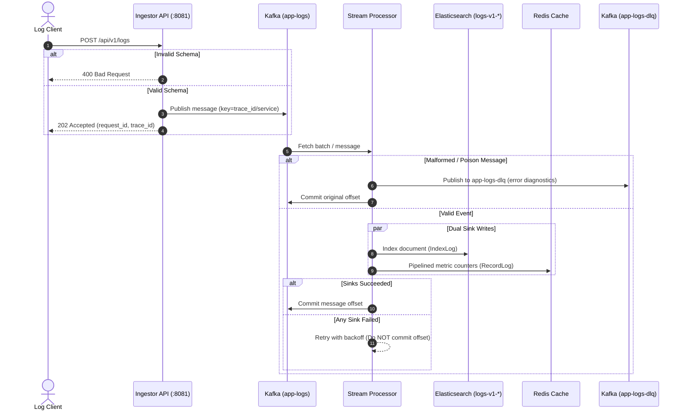
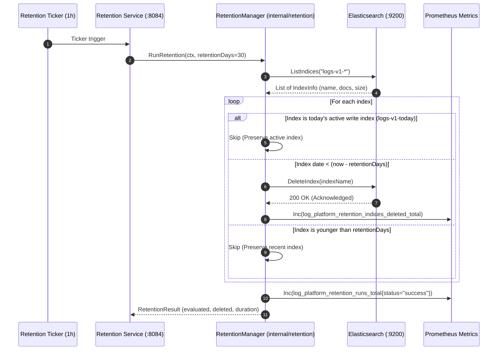
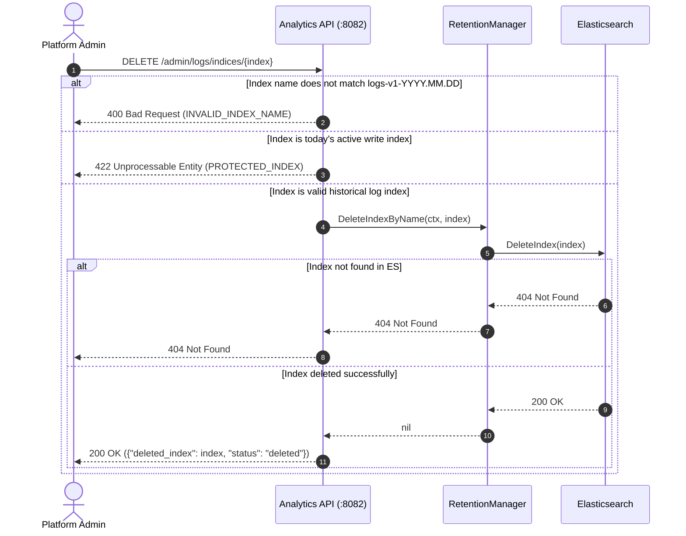
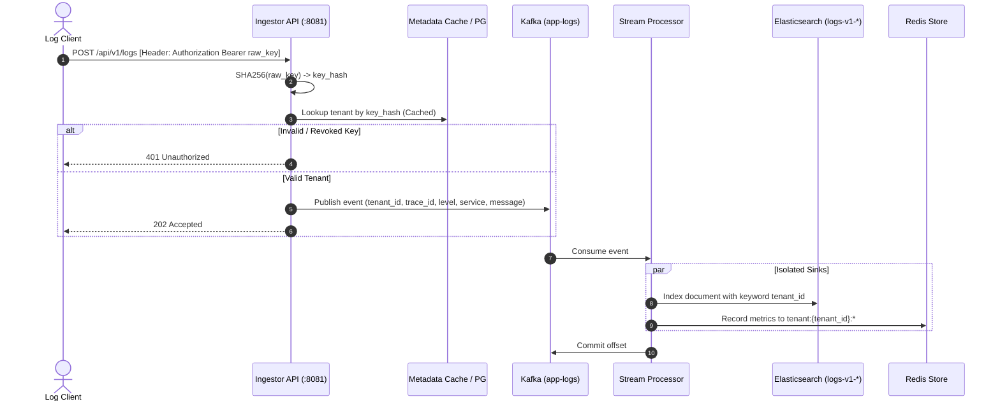

# Sequence Diagrams & Data Flows

> **Version:** 1.0  
> **Date:** 2026-08-06  
> **Status:** Draft  
> **Related:** `01-scope.md`, `03-api-spec.md`, `04-data-model.md`

---

## 1. Legend

```
┌──────┐  Actor / External system
│ Actor│
└──┬───┘
   │
   ▼
┌──────────┐  Service / Component
│ Service  │
└────┬─────┘
   │
   │────▶  Synchronous call (HTTP, function call)
   │
   │───▶│  Asynchronous message (Kafka)
   │
   │───▶  Publish to topic
   │
   │◀───  Consume from topic
   │
   │────▶ Database read/write
   │
   │────▶ Cache read/write
   │
   │────▶ DLQ / Failure path
   │
   ────▶  Returns response
```

---

## 2. Happy Path: Log Ingestion to Searchable

**Scenario:** Client sends a valid log. System processes it. User searches and finds it.

```
Client        Ingestor       PostgreSQL    Kafka         Processor      Elasticsearch    Redis        Analytics
  │              │               │            │              │                │             │              │
  │ POST /logs   │               │            │              │                │             │              │
  │─────────────▶│               │            │              │                │             │              │
  │              │ SELECT service│            │              │                │             │              │
  │              │──────────────▶│            │              │                │             │              │
  │              │◀──────────────│            │              │                │             │              │
  │              │ (service exists)            │              │                │             │              │
  │              │               │            │              │                │             │              │
  │              │ Publish to    │            │              │                │             │              │
  │              │ app-logs      │            │              │                │             │              │
  │              │──────────────▶│───────────▶│              │                │             │              │
  │              │               │            │              │                │             │              │
  │ 202 Accepted │               │            │              │                │             │              │
  │◀─────────────│               │            │              │                │             │              │
  │              │               │            │              │                │             │              │
  │              │               │            │ Consume      │                │             │              │
  │              │               │            │◀─────────────│                │             │              │
  │              │               │            │              │                │             │              │
  │              │               │            │              │ Parse & Validate│             │              │
  │              │               │            │              │                │             │              │
  │              │               │            │              │ Bulk Index (100)│             │              │
  │              │               │            │              │────────────────▶│             │              │
  │              │               │            │              │                │             │              │
  │              │               │            │              │ Update Redis    │             │              │
  │              │               │            │              │───────────────────────────────▶│              │
  │              │               │            │              │                │             │              │
  │              │               │            │              │ Commit Offset   │             │              │
  │              │               │            │◀─────────────│                │             │              │
  │              │               │            │              │                │             │              │
  │              │               │            │              │                │             │              │
  │ GET /search  │               │            │              │                │             │              │
  │───────────────────────────────────────────────────────────────────────────────────────────▶│
  │              │               │            │              │                │             │              │
  │              │               │            │              │                │             │              │
  │              │               │            │              │                │             │              │
  │              │               │            │              │                │ Query ES    │              │
  │              │               │            │              │                │◀────────────│              │
  │              │               │            │              │                │             │              │
  │ 200 OK       │               │            │              │                │             │              │
  │◀───────────────────────────────────────────────────────────────────────────────────────────│
  │              │               │            │              │                │             │              │
```

**Timing expectations:**
- Ingestor → Kafka: < 10ms
- Processor → ES + Redis: < 50ms per batch
- Search query (ES): < 200ms
- Metrics query (Redis): < 10ms

---

## 3. Failure Path: Invalid Log → Dead Letter Queue

**Scenario:** Client sends a log with an unknown service. System rejects at ingestion. Then, a log with valid service but unparseable JSON reaches the processor.

```
Client        Ingestor       PostgreSQL    Kafka         Processor      DLQ Topic
  │              │               │            │              │                │
  │ POST /logs   │               │            │              │                │
  │─────────────▶│               │            │              │                │
  │              │ SELECT service│            │              │                │
  │              │──────────────▶│            │              │                │
  │              │◀──────────────│            │              │                │
  │              │ (service NOT found)         │              │                │
  │              │               │            │              │                │
  │ 400 Bad Req  │               │            │              │                │
  │◀─────────────│               │            │              │                │
  │              │               │            │              │                │
  │              │               │            │              │                │
  │              │               │            │              │                │
  │ POST /logs   │               │            │              │                │
  │─────────────▶│               │            │              │                │
  │              │ SELECT service│            │              │                │
  │              │──────────────▶│            │              │                │
  │              │◀──────────────│            │              │                │
  │              │ (service exists)            │              │                │
  │              │               │            │              │                │
  │              │ Publish       │            │              │                │
  │              │──────────────▶│───────────▶│              │                │
  │              │               │            │              │                │
  │ 202 Accepted │               │            │              │                │
  │◀─────────────│               │            │              │                │
  │              │               │            │              │                │
  │              │               │            │ Consume      │                │
  │              │               │            │◀─────────────│                │
  │              │               │            │              │                │
  │              │               │            │              │ Parse FAILS     │
  │              │               │            │              │ (invalid JSON)  │
  │              │               │            │              │                │
  │              │               │            │              │ Publish to DLQ  │
  │              │               │            │              │────────────────▶│
  │              │               │            │              │                │
  │              │               │            │              │ Commit Offset   │
  │              │               │            │◀─────────────│                │
  │              │               │            │              │                │
```

**Key principle:** The original offset is committed **after** DLQ publish succeeds. This prevents the poison message from being re-consumed indefinitely while ensuring it's not lost.

---

## 4. Real-Time Metrics Query

**Scenario:** User wants to see current error rates without waiting for Elasticsearch indexing.

```
Client        Analytics API    Redis
  │              │               │
  │ GET /metrics │               │
  │─────────────▶│               │
  │              │               │
  │              │ MGET stats:*  │
  │              │──────────────▶│
  │              │◀──────────────│
  │              │               │
  │              │ ZREVRANGE     │
  │              │ leaderboard:* │
  │              │──────────────▶│
  │              │◀──────────────│
  │              │               │
  │ 200 OK       │               │
  │◀─────────────│               │
  │              │               │
```

**Why Redis?** All data is in memory. No disk I/O. No index scanning. Sub-10ms response.

**Why not Elasticsearch?** ES aggregations require scanning the inverted index and computing counts. At scale, this is 100–1000x slower than a Redis `ZREVRANGE`.

---

## 5. Historical Search Query

**Scenario:** User searches for "timeout" in payment-api ERROR logs from the last 7 days.

```
Client        Analytics API    Elasticsearch
  │              │               │
  │ GET /search  │               │
  │─────────────▶│               │
  │              │               │
  │              │ Build bool    │
  │              │ query:        │
  │              │ - match: msg  │
  │              │ - term: svc   │
  │              │ - term: level │
  │              │ - range: time │
  │              │               │
  │              │ POST logs-v1-*/_search
  │              │──────────────▶│
  │              │◀──────────────│
  │              │ (hits + aggs) │
  │              │               │
  │ 200 OK       │               │
  │◀─────────────│               │
  │              │               │
```

**Index pattern:** `logs-v1-*` matches all daily indices. ES routes the query to relevant shards automatically.

**Pagination:** `from=(page-1)*size`, `size=20`.

---

## 6. Service Metadata Lookup

**Scenario:** User lists all services with their applications and environments.

```
Client        Analytics API    PostgreSQL
  │              │               │
  │ GET /services│               │
  │─────────────▶│               │
  │              │               │
  │              │ SELECT + JOIN │
  │              │ services      │
  │              │ applications  │
  │              │ environments  │
  │              │──────────────▶│
  │              │◀──────────────│
  │              │               │
  │ 200 OK       │               │
  │◀─────────────│               │
  │              │               │
```

**Query pattern:**
```sql
SELECT s.id, s.name, a.name AS application, e.name AS environment, s.created_at
FROM services s
JOIN applications a ON s.application_id = a.id
JOIN environments e ON s.environment_id = e.id
ORDER BY s.name;
```

---

## 7. Admin CLI: Creating a Service

**Scenario:** Developer uses `logctl` to register a new service before sending logs.

```
Developer     logctl CLI     Analytics API    PostgreSQL
  │              │               │               │
  │ logctl svc   │               │               │
  │ create ...   │               │               │
  │─────────────▶│               │               │
  │              │               │               │
  │              │ POST /services│               │
  │              │ (internal)    │               │
  │              │──────────────▶│               │
  │              │               │               │
  │              │               │ INSERT INTO   │
  │              │               │ services      │
  │              │               │──────────────▶│
  │              │               │◀──────────────│
  │              │               │               │
  │              │◀─────────────│               │
  │              │               │               │
  │ Created!     │               │               │
  │◀─────────────│               │               │
  │              │               │               │
```

**Why this matters:** You cannot send logs for a service that doesn't exist. This enforces data quality at the ingestion boundary.

---

## 8. Load Generator: Benchmarking

**Scenario:** Developer runs `loadgen` to measure system throughput.

```
loadgen       Ingestor       Kafka         Processor      Elasticsearch    Redis
  │              │            │              │                │             │
  │ POST /logs   │            │              │                │             │
  │ (x1000/sec)  │            │              │                │             │
  │─────────────▶│            │              │                │             │
  │              │ Publish    │              │                │             │
  │              │───────────▶│              │                │             │
  │              │            │              │                │             │
  │ 202 Accepted │            │              │                │             │
  │◀─────────────│            │              │                │             │
  │              │            │              │                │             │
  │ (repeat)     │            │              │                │             │
  │              │            │ Consume      │                │             │
  │              │            │◀─────────────│                │             │
  │              │            │              │ Bulk Index     │             │
  │              │            │              │───────────────▶│             │
  │              │            │              │ Update Redis   │             │
  │              │            │              │─────────────────────────────▶│
  │              │            │              │                │             │
```

**Metrics collected by loadgen:**
- Total requests sent
- Success count (HTTP 202)
- Failure count (non-202)
- Request rate (req/sec)
- Latency percentiles (p50, p99)

---

## 9. Graceful Shutdown

**Scenario:** Developer presses Ctrl+C on the Stream Processor. In-flight work must complete.

```
OS/SIGTERM    Stream Processor    Kafka Consumer    ES Bulk Buffer    Redis Pipeline
  │              │                  │                 │                 │
  │ SIGTERM      │                  │                 │                 │
  │─────────────▶│                  │                 │                 │
  │              │                  │                 │                 │
  │              │ Stop consuming   │                 │                 │
  │              │ (no new polls)   │                 │                 │
  │              │                  │                 │                 │
  │              │ Finish current   │                 │                 │
  │              │ batch processing │                 │                 │
  │              │                  │                 │                 │
  │              │ Flush ES bulk    │                 │                 │
  │              │────────────────────────────────────▶│                 │
  │              │                  │                 │                 │
  │              │ Execute Redis    │                 │                 │
  │              │ pipeline         │                 │                 │
  │              │───────────────────────────────────────────────────────▶│
  │              │                  │                 │                 │
  │              │ Commit Kafka     │                 │                 │
  │              │ offsets          │                 │                 │
  │              │─────────────────▶│                 │                 │
  │              │                  │                 │                 │
  │              │ Exit 0           │                 │                 │
  │              │                  │                 │                 │
```

**Implementation in Go:**
```go
ctx, stop := signal.NotifyContext(context.Background(), os.Interrupt, syscall.SIGTERM)
defer stop()

// Run processor
<-ctx.Done()

// Graceful shutdown
processor.Shutdown(ctx, 30*time.Second)
```

**Timeout:** 30 seconds. If shutdown takes longer, force exit.

---

## 10. System Startup Sequence

**Order matters.** Services must wait for their dependencies.

```
Step 1: Infrastructure
  ├─ PostgreSQL starts
  ├─ Redis starts
  ├─ Elasticsearch starts
  └─ Kafka (KRaft) starts
        └─ Create topics: app-logs, app-logs-dlq

Step 2: Migrations
  └─ Run PostgreSQL migrations (applications, environments, services, etc.)

Step 3: Seed Data
  └─ Insert environments: production, staging, development

Step 4: Services
  ├─ Stream Processor starts (waits for Kafka, ES, Redis)
  ├─ Analytics API starts (waits for Redis, ES, PostgreSQL)
  └─ Log Ingestor starts (waits for Kafka, PostgreSQL)

Step 5: Verification
  ├─ curl localhost:8081/health
  ├─ curl localhost:8082/health
  └─ logctl service list
```

**Docker Compose `depends_on`:**
```yaml
services:
  ingestor:
    depends_on:
      - kafka
      - postgres
  processor:
    depends_on:
      - kafka
      - elasticsearch
      - redis
  analytics:
    depends_on:
      - redis
      - elasticsearch
      - postgres
```

**Note:** `depends_on` only waits for container start, not service readiness. Each Go service should implement retry loops with backoff for its dependencies.

---

## 11. Data Consistency Model

### Source of Truth Hierarchy

```
┌─────────────────────────────────────────┐
│           Kafka (app-logs)              │
│     Source of truth for events          │
└─────────────────┬───────────────────────┘
                  │
      ┌───────────┼───────────┐
      ▼           ▼           ▼
┌─────────┐ ┌─────────┐ ┌─────────┐
│    ES   │ │  Redis  │ │   DLQ   │
│ (search)│ │(metrics)│ │(failures│
│         │ │         │ │  audit) │
└─────────┘ └─────────┘ └─────────┘
   Derived     Derived    Derived
   (index)    (aggregate) (audit)
```

**Key principle:** Kafka is the immutable event log. ES and Redis are **derived views** that can be rebuilt from Kafka if corrupted.

### Failure Recovery

| Failure | Impact | Recovery |
|---------|--------|----------|
| ES index corrupted | Search broken | Reindex from Kafka (replay) |
| Redis data lost | Metrics blank | Rebuild from ES or replay Kafka |
| Kafka data lost | Catastrophic | Not recoverable (Kafka is source of truth) |
| DLQ messages pile up | Audit trail grows | Inspect via `logctl dlq inspect`; fix bug; replay if needed |

---

## 13. Mermaid Sequence Diagrams

### 13.1 Ingestion & Dual-Sink Stream Processing



### 13.2 Automated Background Retention Cycle



### 13.3 Administrative Index Deletion & Safety Rejections



### 13.4 Multi-Tenant Resolution & Log Streaming Flow



---

*These diagrams are the contract for how data moves through the system. When debugging, identify which arrow is broken.*


